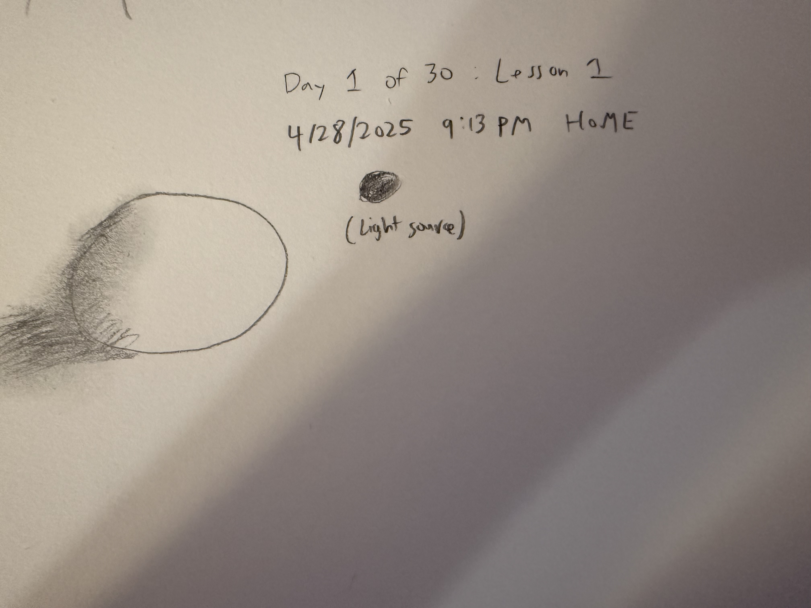

Something I've always wanted to learn how to do was to draw. It is a different way of expression other than writing or speaking, and also provides me a way to let loose whenever I have free time. As such, I was recommended this book called [You Can Draw in 30 Days](https://users.soe.ucsc.edu/~yonge/ASH/Extra/You%20Can%20Draw%20in%2030%20Days%20The%20Fun,%20Easy%20Way%20to%20Learn%20to%20Draw%20in%20One%20Month%20or%20Less.pdf) written by Mark Kistler a while ago and decided now was a good time to see what it was all about and see how much I can hone my drawing skills in 30 days. The book is structured with 30 lessons, corresponding to 1 lesson a day, and I will post my progress for each of the lessons.

## Day 1: Lesson 1
Lesson 1 started off with a bang! Mark talked about the 9 elements of drawing which gives drawings the illusion of depth. The laws are:
1. Foreshadowing
2. Placement
3. Size
4. Overlapping
5. Shading
6. Shadow
7. Contour Lines
8. Horizon Line
9. Density

We then went into a pretest of sorts to warm up our artistic skills by drawing a house, airplabne, and bagel off the top of our heads. We then proceeded to learn how to draw with shadows and shading. This involved starting out with drawing a circle and imagining a light source beaming down on the object at an angle. We then essentially wanted to cast a shadow on the object by drawing a "cast shadow" opposite of the light source to provide more depth to the object. We also employed a technique scribble shading to scribble parts of the object further away from the light source. The intuition is that parts of the object that are further away from the light source are darker while parts that are closer are closer to the light source will appear brighter. We also smudged the shading a little bit to provide some smoothness to the depth. Overall, a very pleasant beginning lesson to shading and drawing!

